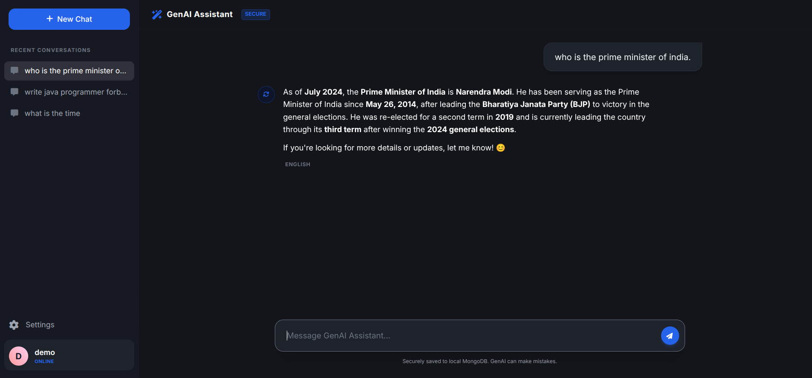

# Multilingual GenAI Assistant

A full-stack, production-ready AI assistant application supporting both English and regional Indian languages. Built with a modern **FastAPI MVC architecture**, **MongoDB** for persistent storage, and styled with **Tailwind CSS**. It leverages Sarvam AI's advanced language models to provide contextual, multilingual interactions with rich Markdown formatting.


## 🌟 What This Project is Capable Of

This application serves as a comprehensive, extensible platform for intelligent conversation. Its capabilities include:

- 🌐 **Native Multilingual Processing**: Chat seamlessly in **English, Hindi, Tamil, Telugu, Kannada, and Malayalam**. The assistant uses heuristic Unicode block analysis to detect languages instantaneously and routes them to Sarvam AI's native linguistic models (`sarvam-m`).
- 🧠 **Context-Aware Conversations**: The chatbot remembers up to 5 of the most recent turns dynamically during the session to maintain deep contextual understanding.
- 🗄️ **Persistent Chat History**: Every conversation is saved securely in a local **MongoDB database**, allowing users to revisit past interactions anytime.
- 🔐 **Robust Authentication System**: Includes full user registration and login flows, secured with **JWT (JSON Web Tokens)** and salted password hashing via **bcrypt**. 
- 🎨 **Rich UI & Markdown Rendering**: Features a highly responsive graphical interface crafted with **Tailwind CSS**. User and assistant inputs render beautiful Markdown seamlessly, parsing bold text, italics, lists, and syntax-highlighted code blocks in real-time utilizing `marked.js` and `DOMPurify`.
- 🛡️ **Graceful Fallbacks and Error Handling**: The system comes encoded with pre-translated fallback messages across all supported languages, ensuring standard user experience even when network drops occur.

[Watch Video](./public/Screencast%20from%202026-03-02%2000-17-59.mp4)


## 🔬 What Was Explored & Done in This Project

Developing this application involved exploring and implementing several industry-standard practices and advanced engineering patterns:

1. **Refactoring to an MVC Architecture**: 
   - Transitioned from a monolithic script to a highly scalable **Model-View-Controller (MVC)** design. 
   - Concerns are strictly separated into dedicated directories: `app/api/endpoints` for routers, `app/core` for configs, `app/models` for schemas, and `app/services` for business logic (e.g., Sarvam API wrappers and DB controllers).
2. **LLM Orchestration with Sarvam AI**:
   - Mastered the integration of the Sarvam API suite. Explored the native `/chat/completions` capabilities of `sarvam-m`.
   - Built a custom internal language detector instead of relying dynamically on third-party APIs for latency optimization.
   - Combined chat completion APIs with structured Translation APIs for complex, cross-language error handling boundaries.
3. **Database Integration & State Management**:
   - Engineered seamless NoSQL integration using `pymongo`. 
   - Designed a robust schema structure accommodating Users and localized Chat Histories separately.
4. **Security Best Practices implementation**:
   - Secured interactions using token-based stateless authentication (JWT).
   - Ensured no plain-text passwords ever touch the database by hashing them securely via `passlib/bcrypt` within the security service.
5. **Modern Full-Stack Integration in a Single Package**:
   - Successfully served a dynamic frontend (`index.html` + `StaticFiles` mounting) through a high-performance ASGI server (`uvicorn` with `FastAPI`).

## 🏗️ Project Structure (MVC)

```text
├── app/
│   ├── api/
│   │   └── endpoints/     # FastAPI route handlers (auth.py, chat.py)
│   ├── core/              # Configuration and Security logic (config.py, security.py)
│   ├── models/            # Pydantic data schemas (schemas.py)
│   ├── services/          # Business logic and integrations (db.py, chatbot_service.py)
│   └── main.py            # FastAPI application entry point
├── static/
│   └── index.html         # Full frontend UI
├── .env                   # Environment variables
└── requirements.txt
```

## 🚀 Getting Started

### Prerequisites

- Python 3.7+
- MongoDB instance running locally (or adjust `MONGO_URI`)
- A [Sarvam AI API key](https://dashboard.sarvam.ai/)

### Installation

1. **Clone the repository:**
   ```bash
   git clone https://github.com/yourusername/multilingual-chatbot.git
   cd multilingual-chatbot
   ```

2. **Install the dependencies:**
   ```bash
   pip install -r requirements.txt
   ```
   *(Requires: `fastapi`, `uvicorn`, `pymongo`, `passlib[bcrypt]`, `pyjwt`, `requests`, `python-dotenv`)*

3. **Configure Environment Variables:**
   Create a `.env` file in the root directory:
   ```env
   SARVAM_API_KEY=your_sarvam_api_key_here
   MONGO_URI=mongodb://localhost:27017
   JWT_SECRET=your_super_secret_jwt_key
   ```

## 💻 Usage

1. **Start the backend server:**
   ```bash
   uvicorn app.main:app --host 0.0.0.0 --port 8000 --reload
   ```

2. **Access the Application:**
   Open your browser and navigate to: **[http://localhost:8000](http://localhost:8000)**

3. **Interact:**
   - Sign up for a new account using the UI authentication modal.
   - Start chatting! Try asking: *"Can you explain quantum computing simply?"* or *"Give me a python hello world format with markdown."*
   - Responses will be elegantly formatted and your history will be preserved in the sidebar.

## 📚 Important Notes
- The free tier of Sarvam AI includes 1,000 credits per month.
- Conversation context is inherently preserved across turns for seamless user interactions.
- Ensure your local MongoDB instance is active on port `27017`, or update the `MONGO_URI` configuration.

## 🔗 Additional Resources

- **Documentation**: [docs.sarvam.ai](https://docs.sarvam.ai/)
- **API Dashboard**: [dashboard.sarvam.ai](https://dashboard.sarvam.ai/)

## 📜 License

This project is licensed under the MIT License - see the LICENSE file for details.
